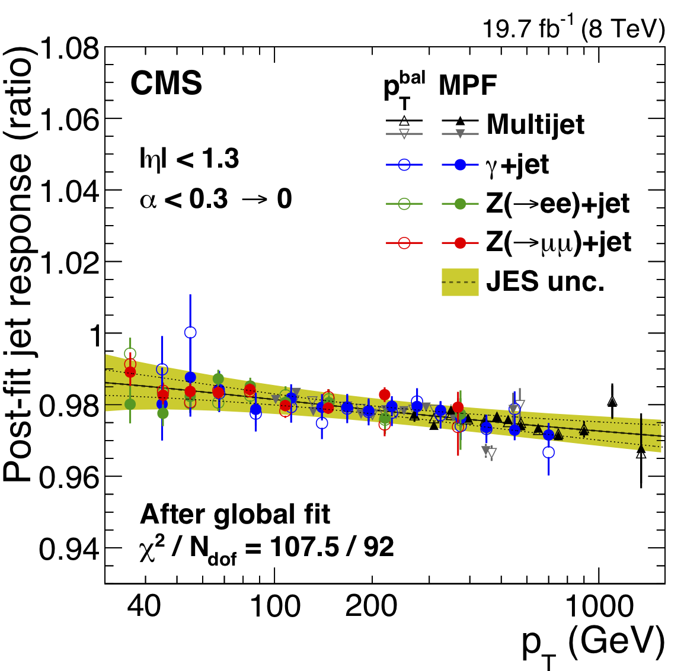

Dans l’environnement hadronique des collisions proton-proton au LHC, un des plus grand défis et une étape fondamentale pour la réussite du programme de physique est la bonne reconstruction des jets, qui sont la manifestation expérimentale des quarks et des gluons de haute énergie produits dans les collisions. Les jets sont des objets complexes et variés : l’hadronisation d’un quark ou un gluon donne lieu à plusieurs produits de désintégration qui sont confondus dans un jet d’énergie observable dans le détecteur. Au delà de leur intérêt intrinsèque, comme sonde de la QCD, les jets sont utilisés dans presque toutes les analyses de physique au LHC. Un des défis de la compréhension des jets est la reconstruction correcte de leur énergie, ce qui est cruciale pour plusieurs analyses de physique, les incertitudes sur l’énergie des jets étant pour certaines mesures la source principale d’incertitude systématique. 

Le groupe CMS de l’IPNL est fortement engagé dans les activités de détermination de l’echelle et de la resolution en énergie des jets, qui se fait par la combinaison de plusieurs analyses sur les données et les événements simulés. En particulier, le groupe est responsable de l’analyse d’événements avec un photon et un jet et des événements avec plusieurs jets dont un de très haute énergie.
La contribution de ces deux analyses (appelées gamma+jet et multijet, respectivement) est visible dans la Figure 1, où elles sont combinées dans un ajustement avec d’autres résultats pour obtenir une connaissance optimale de l’echelle en énergie des jets. Cette connaissance est exploité par la collaboration entière, ce qui assure une bonne visibilité du groupe de Lyon au sein de CMS.  

*Figure 1 : Ajustement globale utilisé pour extraire une meilleure connaissance de l’énergie des jets, en combinant les informations des plusieurs analyses. L’axe des abscisses répresente l’énergie des jets, l’axe des ordonnées le rapport entre l’énergie reconstruite par le détecteur et la vraie énergie du jet. De cette information on peut extraire des constantes permettant de calibrer l’énergie des jets et des uncertitudes systématiques, qui sont utilisées pas l’ensemble de la collaboration CMS.*

Finalement, le groupe de l’IPNL a été pionnier dans les études, basées sur les données, de la correlation entre l’énergie reconstruite pour un jet dans le détecteur et sa saveur (c’est à dire s’il a été produit par un quark léger u, d, s par un quark lourd c, un quark lourd b ou par un gluon).  Ce phénomène, qui est pour le moment contraint uniquement à partir des simulation est à l’origine d’une des incertitudes dominantes dans la connaissance de l’énergie des jets.

 Un membre du groupe a eu la responsabilité de la coordination du groupe de travail, dédié à l’echelle et la resolution en énergie des jets au sein de CMS, pour la période 2015-2017 et a été editeur du papier de référence pour les jets du Run I, publié en 2017. 
