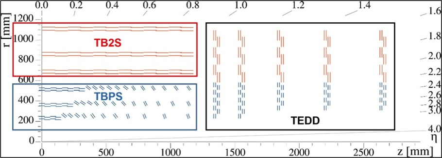
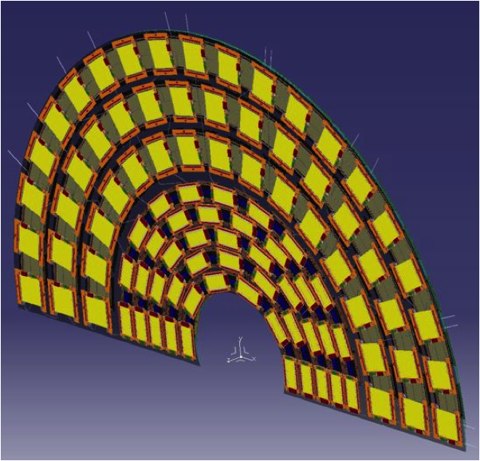
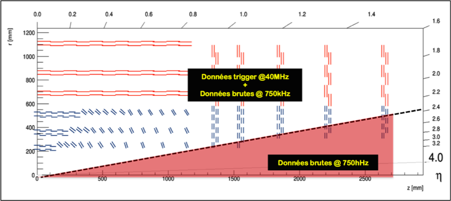
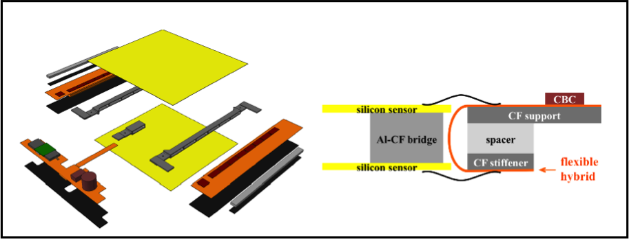
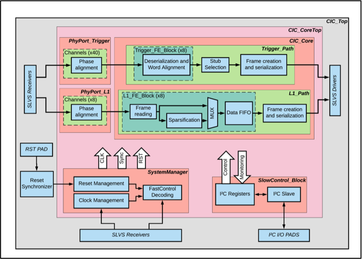
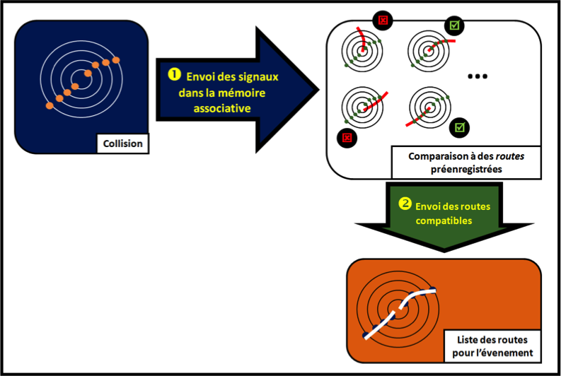
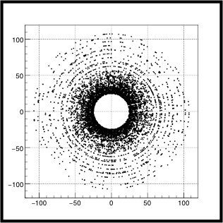
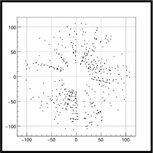

# Contributions du groupe CMS IPNL à l’upgrade du trajectographe de CMS

Le futur trajectographe de CMS, dont la structure est représentée sur la Figure 1, devra répondre aux défis complexes du HL-LHC. Pour ce faire, il sera plus précis que le détecteur actuel (meilleure granularité, moins de matière traversée), et ses données seront utilisées dès le premier niveau du système de déclenchement, à la fréquence de 40MHz. 


*Figure 1 : Vue transversale du futur trajectographe de CMS.*

L’IPNL, fort de son expertise acquise lors de la construction du détecteur actuel, s’est naturellement impliqué sur ces deux aspects, via le design des supports des bouchons (TEDD) et le développement de la chaîne d’acquisition et du système de déclenchement.

## Mécanique des bouchons du trajectographe 

Par rapport au détecteur actuel, les structures de support des modules de détection seront entièrement revues afin de minimiser la quantité de matière traversée. Cela permettra d’optimiser la résolution des paramètres des traces. Un système de refroidissement entièrement nouveau, à base de CO2 diphasique, sera également mis en place afin de réduire la masse totale du système.

Comme on peut le voir dans la Figure 1, le trajectographe se divisera en trois sous-structures : le tonneau classique (TB2S), le tonneau tilté (TBPS) et les bouchons (TEDD). C’est sur cette dernière partie que l’IPNL est engagé depuis 2013. Pour rappel, l’IPNL a largement contribué à l’élaboration des bouchons du trajectographe actuel : cette activité s’inscrit donc dans une continuité mettant à profit les compétences et l’expertise du laboratoire. 

Le principal objectif de la R&D actuelle est l’élaboration des disques du futur trajectographe (Figure 2) via la réalisation des Dees (Figure 3). Chaque disque sera un assemblage de 4 « Dees » sur chacun desquels une centaine de modules seront installés. 



*Fig 2: Les bouchons du trajectographe de CMS*


*Fig 3: Vue d'un Dee (chaque disque est composé de quatre Dees)*

Un premier prototype couvrant un septième de la surface globale d’un Dee, et incluant l’infrastructure nécessaire au refroidissement, a été réalisé en 2016 à l’IPNL. Ce prototype, visible dans la Figure 4, a été suivi par un second en 2017 qui a permis d’atteindre les spécifications mécaniques requises. Il est prévu de réaliser un prototype de Dee entier dès la fin de l’année 2018. 



*Fig 4: Structure interne d'un Dee (vue de gauche) et premier prototype (vue de droite)* 

A moyen terme, l’IPNL souhaite s’engager dans l’assemblage des modules sur les Dees, et la qualification des Dees d’un des bouchons du futur détecteur. Une salle d’assemblage, qui sera opérationnelle à l’automne 2018, est en cours de réalisation à l’IPNL.
L’IPNL est aussi impliqué sur la conception de la structure mécanique globale du TEDD.

## Concentrateurs de données 

Le trajectographe actuel de CMS n’étant inclus dans le système de déclenchement qu’à partir du niveau 2 (HLT), ses données ne sont extraites qu’à la fréquence relativement modeste de 100kHz.

Comme on peut le voir sur la Figure 5, le cahier des charges du futur trajectographe sera tout autre. La majeure partie du détecteur devra en effet, en plus des données de niveau 2, envoyer également les informations dès le niveau 1, c’est à dire à 40MHz. Cette nouvelle contrainte, absolument nécessaire, induit une refonte totale de la chaîne d’acquisition, mais également du fonctionnement des modules de détection.

Le futur module de détection, également nommé pT-module, est un élément clé du système. La Figure 6 représente un des 2 types de modules qui seront installés dans le détecteur (représentés en rouge dans la Figure 5) : les modules 2S (pour strips/strips). La structure de base, deux couches de détection en silicium (en jaune sur la figure) séparées de quelques mm, est un principe relativement standard dans les détecteurs de traces actuels. L’électronique de lecture, par contre, est entièrement nouvelle. En effet, comme on peut le voir dans la figure de droite, le signal des 2 couches peut être mis en coïncidence dans le module lui-même. Ce point est fondamental car il est ainsi possible de réduire significativement la quantité de signal à extraire (en pratique environ un ordre de grandeur). Cette première étape n’étant cependant pas suffisante, un second étage de compression est nécessaire pour parvenir à un niveau de données acceptable (quelques dizaines de Tb/s).



*Fig 5: Extraction des données dans le futur trajectographe*



*Fig 6: Vue éclatée d'un pT module*

Ce second étage est réalisé par le circuit concentrateur (CIC). Le CIC est un ASIC (Application-Specific Integrated Circuit) dont le développement est sous la responsabilité de l’IPNL depuis 2012. C’est un système complexe, qui doit être compatible avec les différents types de modules de détection (selon la position du module dans le détecteur, 2 électroniques de lecture différentes sont prévues) et résistant aux radiations. C’est également un point clé de la chaîne d’acquisition, et notre engagement est de ce fait une responsabilité très importante. 

Le principe de fonctionnement du CIC est schématisé dans la Figure 7. Le circuit intégré reçoit les informations provenant de 8 chips identiques (CMS Binary Chip, CBC, ou Macro Pixel ASIC, MPA) dans lesquels le signal a été préalablement numérisé et traité (création de « stubs »). Il reformate ces données, les traite et les groupe en paquets avant de les envoyer vers un autre circuit qui effectue la transmission du signal en-dehors du détecteur.



*Fig 7: Principe de fonctionnement du CIC* 

Sachant que les pertes au niveau du concentrateur doivent être minimales, le taux de compression minimal requis est simple à obtenir : 8 dans le cas classique (sortie à 320MHz) et 4 pour le mode rapide (sortie à 640MHz) qui devra être utilisé dans les couches internes du détecteur. Afin de réduire la consommation en énergie du chip, celui-ci est réalisé en technologie TSMC 65nm. Il s’agit du premier chip complet réalisé dans cette technologie à l’IN2P3.

Le chip entre désormais dans sa dernière phase de développement. L’ensemble des spécifications a été défini et le modèle définissant la structure interne du chip est complet et validé, comme en atteste le diagramme-bloc représenté dans la Figure 8. La fonderie du premier prototype est prévue pour le milieu de l’année 2018. Une seconde itération est prévue dès mi-2019, afin d’aboutir à une version de pré-production.



*Figure 8 : Diagramme bloc du concentrateur.*

## Déclenchement 

Une fois extraites, les données sont transmises au système de reconstruction de traces rapides. Le défi à relever est le suivant : comment traiter ~50Tb de données en moins de 5 microsecondes. Ce défi peut se diviser en 2 parties relativement distinctes : distribution de données et reconstruction des traces.

Concernant la distribution des données, il est en effet tout à fait inenvisageable d’acheminer un tel flux de données dans une seule carte de traitement. On divise donc l’information en temps et en espace (multiplexage). Le système final est ainsi composé d’un certain nombre de cartes qui traitent chacune les informations d’une partie du détecteur (diminution de la quantité de données à traiter) pour une partie des collisions (augmentation du temps disponible pour le traitement).

Une fois cette étape effectuée, les traces contenues dans l’échantillon de données sont reconstruites par un système dédié. C’est sur ce domaine que la contribution de l’IPNL s’est concentrée.

La reconstruction de traces est un processus en 2 étapes : identification des candidats traces (pattern recognition) et calcul des paramètres des traces (fit). Parmi ces 2 étapes, la première est la plus complexe à réaliser dans une latence très courte. Les méthodes conventionnelles étant en effet très sensibles à l’empilement, il est nécessaire de privilégier les méthodes dont le temps de calcul évolue linéairement avec le nombre de stubs. La méthode retenue par l’IPNL se base sur l’utilisation de mémoires associatives. Le principe de fonctionnement de cette technique est schématisé dans la Figure 9.


*Fig 9: Principe de fonctionnement des mémoires associatives*

Les signaux sont comparés à une banque de traces préenregistrées dans un chip dédié. Lorsqu’une trace est entièrement activée, le chip envoie l’information vers le système effectuant le calcul des paramètres de la trace.

Cette technique, qui a déjà été utilisée dans d’autres détecteurs, présente de nombreux avantages : elle est rapide, peu sensible à l’empilement et très flexible (le chip contenant les candidats traces peut être reconfiguré à tout moment).

L’activité du groupe s’est d’abord concentrée sur l’estimation des performances de cette méthode dans le contexte du HL-LHC. Une simulation complète, incluant une émulation bit-à-bit des chips AM, a été développée et intégrée à l’environnement de simulation officiel de CMS. 

De nombreuses optimisations ont été effectuées grâce à cet environnement de simulation. Un algorithme spécifique de post-traitement (TC builder) a également été développé, afin d’optimiser la pureté des données transmises au fit. La Figure 10 montre le déroulement de cette procédure sur un événement type au HL-LHC (paire de tops et empilement de 200). La puissance du filtrage des mémoires associatives est clairement mise en évidence : 90% du bruit est éliminé.

 
 

*Fig. 10 : Fonctionnement des mémoires associatives sur un événement HL-LHC typique*

Afin de poursuivre le développement de cette approche de manière plus concrète, et en particulier la mise au point d’une nouvelle génération de chips adaptés au HL-LHC, le groupe CMS de l’IPNL, conjointement avec le groupe ATLAS du LPNHE, a obtenu en 2014 un financement ANR . Grâce à ce financement, un premier démonstrateur a pu être développé à l’IPNL. Ce dispositif est représenté dans la Figure 11. 
Ce système se compose d’une carte d’évaluation (Xilinx KCU105) et d’une mezzanine, embarquant un chip AM actuel, réalisée à l’IPNL. Un firmware permettant d’envoyer des stubs et de récupérer des proto-traces (après le post filtrage) a été développé et testé, également à l’IPNL.
Ce banc de test est totalement opérationnel depuis la fin de l’année 2016. L’accord entre notre simulation et le banc de test est parfait, ce qui permet ainsi de valider toutes les estimations de performances effectuées jusqu’à présent. La latence totale mesurée est également en accord avec nos estimations. Ce système, qui comporte un chip AM non optimal, permet déjà de traiter des événements typiques du HL-LHC en moins de 10 microsecondes. 

 

*Fig. 11: Banc de test pour l’étude de la reconstruction de traces en temps réel développé à l’IPNL*

L’aboutissement du projet a été l’étude des performances du premier chip de nouvelle génération, démarré en 2017. Ce nouvel ASIC, en technologie TSMC 28nm, s’est avéré parfaitement fonctionnel, ouvrant ainsi la porte au développement du système final. 

Cependant, l’équipe de direction du trajectographe de CMS a décidé à la fin de l’année 2016 de ne plus soutenir cette voie de développement, privilégiant une approche purement basée sur des composants programmables (FPGA). Le développement de cette approche se poursuivant uniquement dans la collaboration ATLAS, il a été décidé de ne pas poursuivre cette activité à l’IPNL.
